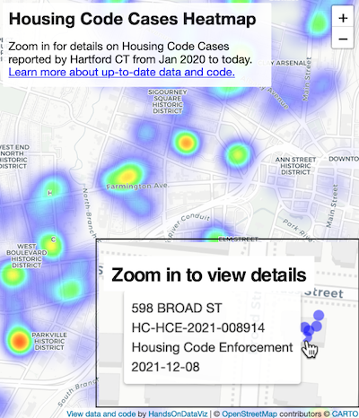

# Housing Code Cases Heatmap
- Live view https://handsondataviz.github.io/housing-code-cases-map
- Default view is a heat map, which changes to a point map with info windows at zoom level 17.



## Data
- City of Hartford, Socrata open data, Housing Code Cases: https://data.hartford.gov/Housing-Development/HousingCodeCases_01012011_Current/86ax-cfey
  - IMPORTANT: Always check Socrata open data repository for dates when "Data Last Updated" and "Metadata Last Updated". When this code was created in March 2022, the data was last updated on 19 December 2021, but the metadata was last updated on 4 March 2022, meaning that no new data had been added since Dec 2021.
- Hartford parcel boundaries, Capitol Region 2021: https://portal.ct.gov/OPM/IGPP/ORG/GIS2/Parcel-Data

## Methods
- IMPORTANT: The status and quality of data in this continuously-updated map depends entirely on the City of Hartford Socrata open data platform for Housing Code Cases.
- View the raw data feed for Hartford Housing Code Cases via its Socrata API (Application Programming Interface) at <https://data.hartford.gov/resource/86ax-cfey.json>
- The code uses this Socrata API to query all Housing Code Cases reported from Jan 2020 to present and to pull selected variables: case_number, parcel_id, location, complaintviolation (type of complaint), and (date) reported.
```
$.getJSON(
  'https://data.hartford.gov/resource/86ax-cfey.json?'
    + '$select=case_number,parcel_id,location,complaintviolation,reported'
    + '&$limit=99999999&$where=reported>="2020-01-01"',
```
- Hartford parcel boundary centroids were pre-calculated in `hartford-parcels`, and the code draws on these to add lat/lng to cases where possible. Only cases that can be associated with an existing Hartford parcel are displayed in the map.
- To avoid stacking multiple cases from the same address on top of each other (such as numerous complaints at a large apartment building), the code injects a small amount of "noise" into the coordinates on the fly. The maximum value for noise is 0.0001, which is roughly 10 meters (30 ft).
- When users zoom in to level 17 or higher, selected details appear in the info window for each case. See the Socrata open data repo for additional details about parcel number, property ownership, and date closed.


## Credits
Developed by <https://HandsOnDataViz.org>: Ilya Ilyankou / Picturedigits and Jack Dougherty, with support from the Office of Community Learning at Trinity College, CT.

See Leaflet Maps with Open Data APIs template: https://handsondataviz.org/leaflet-maps-open-data-apis.html

See Leaflet Heatmap template: https://github.com/HandsOnDataViz/leaflet-heatmap

Learn more about how to create your own Leaflet maps at <https://HandsOnDataViz.org>
